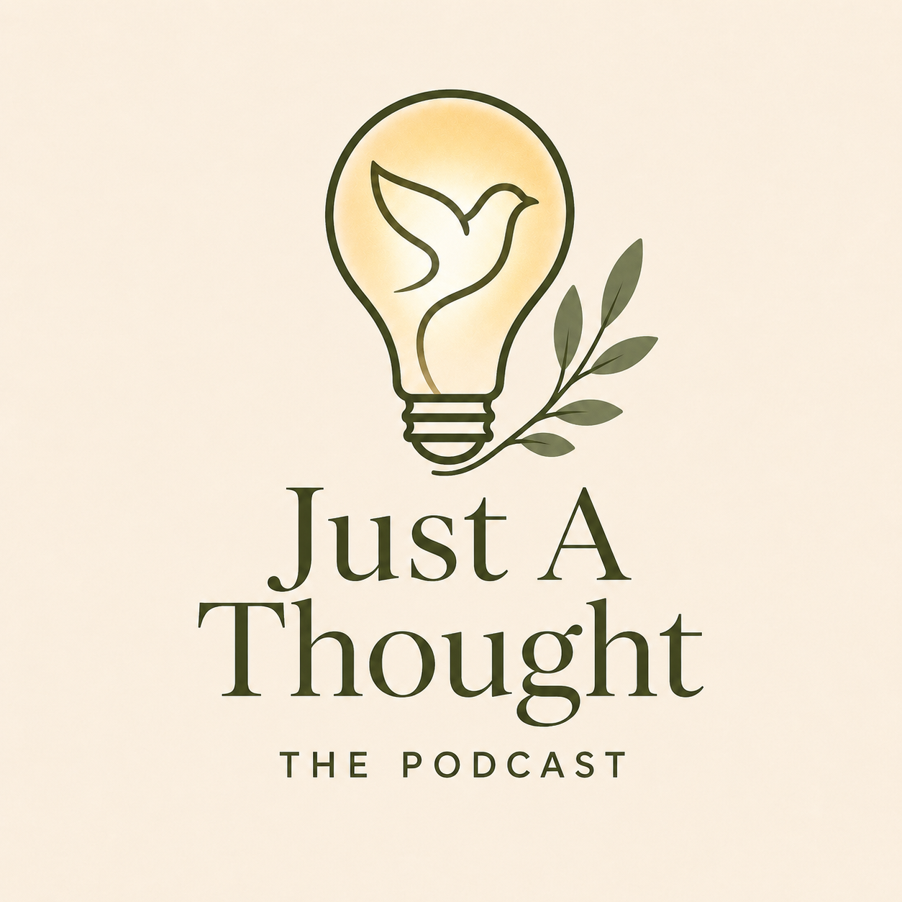

# Just A Thought Logo Usage Guide

This guide explains when and how to use each Just A Thought logo asset across the blog, podcast, social media, resources, and internal materials.

## Recommended Repository Location

Place this guide here:

```text
/docs/brand/logo-usage-guide.md
```

Place all logo files here:

```text
/img/brand/logos/
```

The examples below assume the guide lives in `/docs/brand/` and the logo files live in `/img/brand/logos/`.

If this guide is later converted into a public Jekyll page, replace paths like this:

```html
../../img/brand/logos/just-a-thought-blog-logo-primary.png
```

with this:

```liquid
{{ '/img/brand/logos/just-a-thought-blog-logo-primary.png' | relative_url }}
```

---

## Logo Asset Folder Structure

```text
Just-a-Thought-Blog/
├── docs/
│   └── brand/
│       └── logo-usage-guide.md
└── img/
    └── brand/
        └── logos/
            ├── just-a-thought-blog-logo-primary.png
            ├── just-a-thought-blog-logo-horizontal.png
            ├── just-a-thought-logo-secondary.png
            ├── just-a-thought-icon.png
            ├── just-a-thought-favicon.png
            ├── just-a-thought-podcast-logo.png
            ├── just-a-thought-podcast-icon.png
            ├── just-a-thought-logo-dark-mode.png
            ├── just-a-thought-logo-light-mode.png
            ├── just-a-thought-logo-horizontal-transparent-hd.png
            └── just-a-thought-jat-monogram-transparent-hd.png
```

---

## Core Logo Rule

Use the full **Just A Thought** identity whenever the audience needs to recognize the brand clearly.

Use the **icon-only mark** or **JAT monogram** only when space is limited, when the full brand name is already nearby, or when the use is internal, social, avatar-style, or watermark-based.

---

# Logo Asset Inventory

## Primary Blog Logo

**File:** `just-a-thought-blog-logo-primary.png`  
**Purpose:** Main stacked blog logo

<div align="center">
  
</div>

**Best for:**

- Homepage hero
- Brand boards
- PDF covers
- Devotional covers
- Resource bundle covers
- Social media profile headers

**Avoid using for:**

- Small website headers
- Favicons
- Tight horizontal spaces

---

## Horizontal Blog Logo

**File:** `just-a-thought-blog-logo-horizontal.png`  
**Purpose:** Website header / navigation logo

<div align="center">
  
</div>

**Best for:**

- Website navigation header
- Email header
- Blog footer
- Horizontal banners

**Recommended website size:**

- Desktop: `180–260px` wide
- Mobile: `140–180px` wide

---

## Secondary Short Logo

**File:** `just-a-thought-logo-secondary.png`  
**Purpose:** Short version without “Blog” or “The Podcast”

<div align="center">
  
</div>

**Best for:**

- Quote graphics
- Footer marks
- Social graphics
- Mobile wallpapers
- Simple brand moments

**Avoid using for:**

- First-time brand introductions where readers need to know it is the blog
- Podcast-specific materials

---

## Icon-Only Mark

**File:** `just-a-thought-icon.png`  
**Purpose:** Icon-only lightbulb, dove, and olive mark

<div align="center">
  
</div>

**Best for:**

- Social profile image
- Watermark
- Small buttons
- Brand accents
- Stickers or badges
- Mobile use

**Avoid using for:**

- First-time brand introductions without the full name nearby

---

## Favicon

**File:** `just-a-thought-favicon.png`  
**Purpose:** Browser favicon

<div align="center">
  
</div>

**Best for:**

- Browser tab icon
- Website shortcut icon
- Small app-style icon

**Recommended site reference:**

```html
<link rel="icon" type="image/png" href="{{ '/img/brand/logos/just-a-thought-favicon.png' | relative_url }}">
```

---

## Podcast Logo

**File:** `just-a-thought-podcast-logo.png`  
**Purpose:** Podcast cover logo

<div align="center">
  
</div>

**Best for:**

- Podcast cover art
- Podcast landing page
- Episode graphics
- Podcast promotional images

**Recommended podcast cover size:**

```text
3000 x 3000px
```

**Avoid using for:**

- Blog-only pages where “The Podcast” may confuse the reader

---

## Podcast Icon

**File:** `just-a-thought-podcast-icon.png`  
**Purpose:** Podcast profile/avatar mark

<div align="center">
  
</div>

**Best for:**

- Spotify profile/avatar
- Apple Podcasts avatar
- Podcast social profile image
- Small episode badge

---

## Light-Mode Logo

**File:** `just-a-thought-logo-light-mode.png`  
**Purpose:** Logo for cream/light backgrounds

<div align="center" style="background:#F6F1E7; padding:32px; border-radius:12px;">
  
</div>

**Best for:**

- Warm cream backgrounds
- Soft parchment backgrounds
- White or light beige layouts
- Printable materials
- Light website sections

---

## Dark-Mode Logo

**File:** `just-a-thought-logo-dark-mode.png`  
**Purpose:** Logo for dark backgrounds

<div align="center" style="background:#252822; padding:32px; border-radius:12px;">
  
</div>

**Best for:**

- Dark mode website sections
- Dark footer
- Dark social graphics
- Low-light photography
- Deep olive or charcoal backgrounds

---

## HD Transparent Horizontal Logo

**File:** `just-a-thought-logo-horizontal-transparent-hd.png`  
**Purpose:** HD transparent master logo for overlays and scalable PNG use

<div align="center" style="background:#F6F1E7; padding:32px; border-radius:12px;">
  
</div>

**Best for:**

- Website hero overlays
- Canva graphics
- Video thumbnails
- Social graphics
- Presentations
- Transparent overlay use

**Avoid using for:**

- Favicons
- Small profile icons
- Places where the full wordmark becomes unreadable

---

## JAT Monogram

**File:** `just-a-thought-jat-monogram-transparent-hd.png`  
**Purpose:** JAT monogram / secondary brand mark

<div align="center" style="background:#F6F1E7; padding:32px; border-radius:12px;">
  
</div>

**Best for:**

- Internal files
- Draft graphics
- Social avatar variation
- Watermark
- Small-space secondary mark

**Avoid using for:**

- Main website logo
- Main podcast cover
- First-time public brand introduction

**Rule of thumb:**

Use the JAT monogram only when the audience already knows what it means or when **Just A Thought** appears nearby.

---

# Usage Mockups

## 1. Website Header / Navigation

**Use:** `just-a-thought-blog-logo-horizontal.png` or `just-a-thought-logo-horizontal-transparent-hd.png`

<div style="background:#F6F1E7; padding:24px; border-radius:12px;">
  
  <span style="float:right; font-family:Arial, sans-serif; color:#252822; padding-top:18px; font-size:14px; letter-spacing:.04em;">
    Faith &nbsp;&nbsp; Marriage &nbsp;&nbsp; Leadership &nbsp;&nbsp; Culture &nbsp;&nbsp; Technology &nbsp;&nbsp; Camping
  </span>
  <div style="clear:both;"></div>
</div>

**Why:**

The horizontal logo fits naturally in a website header without making the navigation too tall.

---

## 2. Homepage Hero Section

**Use:** `just-a-thought-blog-logo-primary.png` or `just-a-thought-logo-light-mode.png`

<div align="center" style="background:#F6F1E7; padding:48px 24px; border-radius:12px;">
  
  <p style="font-family:Georgia, serif; font-size:24px; color:#252822; max-width:720px; margin:24px auto 0;">
    Reflecting on faith, life, and the thoughts that shape us.
  </p>
</div>

**Why:**

The stacked logo feels more formal, reflective, and editorial. It works well when introducing the brand.

---

## 3. Blog Post Header

**Use:** the normal website header logo, then let the post title be the focus.

<div style="background:#F6F1E7; padding:28px; border-radius:12px;">
  
  <hr style="border:0; border-top:1px solid #A8B68A; margin:24px 0;">
  <p style="font-family:Arial, sans-serif; color:#7A7468; letter-spacing:.08em; text-transform:uppercase; font-size:12px;">Marriage · Leadership · Faith</p>
  <h1 style="font-family:Georgia, serif; color:#252822; font-size:36px; line-height:1.1; margin-bottom:8px;">Strong Enough to Be Gentle</h1>
  <p style="font-family:Arial, sans-serif; color:#7A7468;">By Jeff Thomas III</p>
</div>

**Avoid:**

Do not place a large logo above every blog post title. It can compete with the article itself.

---

## 4. Footer

**Use:** `just-a-thought-logo-secondary.png` or `just-a-thought-logo-dark-mode.png`

<div align="center" style="background:#252822; padding:40px 24px; border-radius:12px; color:#F6F1E7;">
  
  <p style="font-family:Arial, sans-serif; max-width:720px; margin:24px auto 0; color:#F6F1E7; line-height:1.6;">
    Faith-informed reflections on Scripture, marriage, leadership, culture, technology, camping, and everyday life.
  </p>
</div>

**Why:**

The footer does not need the most formal version every time. A simpler logo with a short description keeps the page calm and clear.

---

## 5. Social Media Profile Image

**Use:** `just-a-thought-icon.png` or `just-a-thought-jat-monogram-transparent-hd.png`

<div align="center" style="background:#F6F1E7; padding:32px; border-radius:12px;">
  
  
</div>

**Recommendation:**

Use the icon-only lightbulb/dove/olive mark as the main public profile image. Use the JAT monogram as a secondary or internal variation.

---

## 6. Quote Graphic / Social Post

**Use:** `just-a-thought-logo-secondary.png` or `just-a-thought-icon.png`

<div style="background:#EFE4D3; padding:40px; border-radius:12px; text-align:center;">
  <p style="font-family:Georgia, serif; color:#252822; font-size:28px; line-height:1.35; max-width:760px; margin:0 auto 28px;">
    “Sometimes the smallest thought opens the door to deeper reflection.”
  </p>
  
</div>

**Recommended placement:**

Bottom center or bottom right.

---

## 7. Podcast Cover Art

**Use:** `just-a-thought-podcast-logo.png`

<div align="center" style="background:#F6F1E7; padding:48px 24px; border-radius:12px;">
  
</div>

**Recommended size:**

```text
3000 x 3000px
```

**Why:**

The podcast identity should be distinct from the blog while remaining visually connected.

---

## 8. Podcast Episode Graphic

**Use:** `just-a-thought-podcast-logo.png` or `just-a-thought-podcast-icon.png`

<div style="background:#EFE4D3; padding:40px; border-radius:12px; text-align:center;">
  
  <p style="font-family:Arial, sans-serif; color:#7A7468; letter-spacing:.12em; text-transform:uppercase; font-size:13px; margin-top:24px;">Episode 03</p>
  <h2 style="font-family:Georgia, serif; color:#252822; font-size:34px; margin:8px 0 0;">When Love Needs Kindling</h2>
</div>

**Avoid:**

Do not use the blog logo with “BLOG” on podcast-specific graphics.

---

## 9. Email Newsletter Header

**Use:** `just-a-thought-blog-logo-horizontal.png` or `just-a-thought-logo-horizontal-transparent-hd.png`

<div align="center" style="background:#F6F1E7; padding:32px; border-radius:12px;">
  
  <p style="font-family:Georgia, serif; font-size:22px; color:#252822; margin-top:24px;">A Thought for the Week</p>
</div>

**Recommended width:**

```text
500–700px
```

---

## 10. PDF Covers / Devotional Resources / Handouts

**Use:** `just-a-thought-blog-logo-primary.png`

<div align="center" style="background:#F6F1E7; padding:52px 24px; border-radius:12px;">
  
  <h1 style="font-family:Georgia, serif; color:#252822; font-size:38px; margin-top:36px;">From Aleph to Taw</h1>
  <p style="font-family:Arial, sans-serif; color:#7A7468; font-size:16px;">A Reflective Psalm 119 Devotional Guide</p>
</div>

**Why:**

The stacked logo has a formal, finished feel that works well for covers and resource materials.

---

## 11. Watermark Use

**Use:** `just-a-thought-icon.png` or `just-a-thought-jat-monogram-transparent-hd.png`

<div style="background:#F6F1E7; padding:48px; border-radius:12px; text-align:center; position:relative;">
  
  <p style="font-family:Georgia, serif; color:#252822; font-size:28px; margin-top:-120px; position:relative;">
    Watermark behind reflective content
  </p>
</div>

**Recommended opacity:**

```text
Background watermark: 8–15%
Corner watermark: 50–75%
```

**Avoid:**

Do not use the full wordmark as a large watermark behind body text. It may hurt readability.

---

# Light vs. Dark Background Rules

| Background Type | Use This Logo |
|---|---|
| Warm cream | `just-a-thought-logo-light-mode.png` |
| Soft parchment | `just-a-thought-logo-light-mode.png` |
| White or light beige | `just-a-thought-logo-light-mode.png` |
| Deep olive | `just-a-thought-logo-dark-mode.png` |
| Charcoal ink | `just-a-thought-logo-dark-mode.png` |
| Dark forest photography | `just-a-thought-logo-dark-mode.png` |
| Hero images / overlays | `just-a-thought-logo-horizontal-transparent-hd.png` |

---

# Quick Decision Guide

| Need | Use |
|---|---|
| Website header | `just-a-thought-blog-logo-horizontal.png` |
| Homepage hero | `just-a-thought-blog-logo-primary.png` |
| Public social avatar | `just-a-thought-icon.png` |
| Internal avatar or small mark | `just-a-thought-jat-monogram-transparent-hd.png` |
| Podcast cover | `just-a-thought-podcast-logo.png` |
| Podcast avatar | `just-a-thought-podcast-icon.png` |
| Dark footer | `just-a-thought-logo-dark-mode.png` |
| Light/cream layout | `just-a-thought-logo-light-mode.png` |
| Transparent overlay | `just-a-thought-logo-horizontal-transparent-hd.png` |
| Browser tab | `just-a-thought-favicon.png` |

---

# Daily Use Set

Keep these assets easy to access:

```text
just-a-thought-logo-horizontal-transparent-hd.png
just-a-thought-blog-logo-primary.png
just-a-thought-icon.png
just-a-thought-podcast-logo.png
just-a-thought-jat-monogram-transparent-hd.png
just-a-thought-logo-dark-mode.png
```

These six files will cover most website, social, podcast, presentation, and resource needs.
